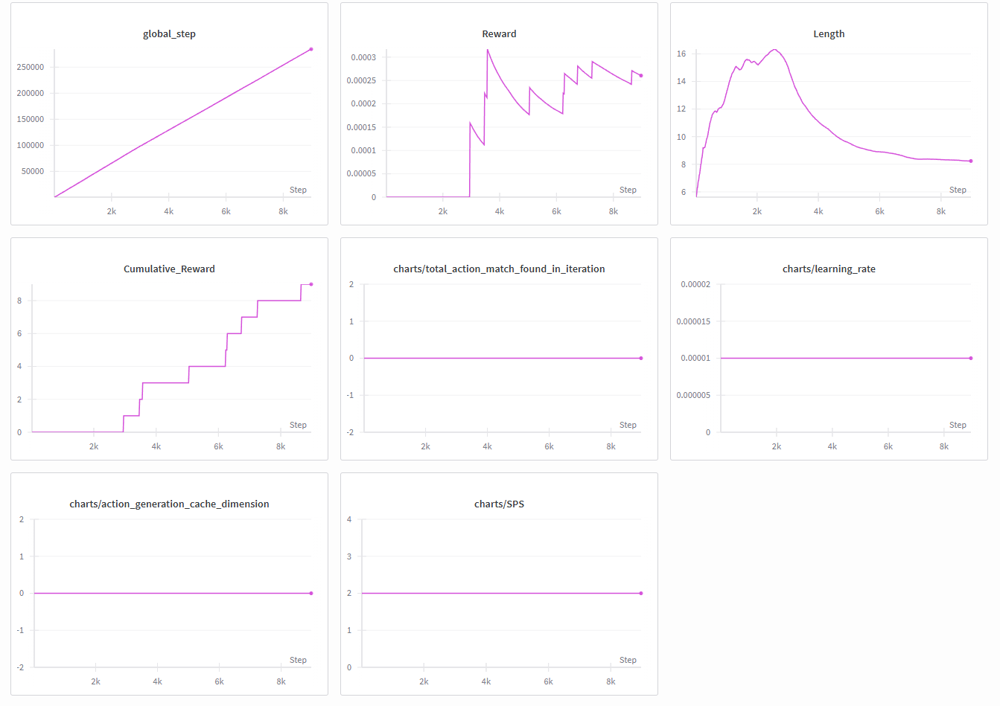
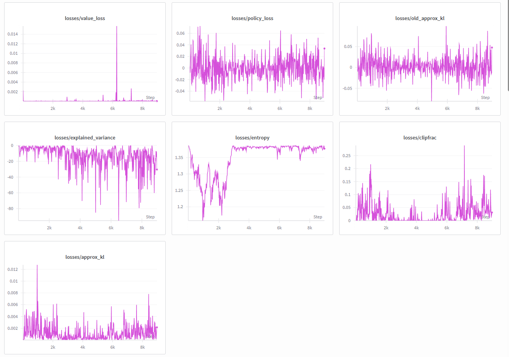

# BrainStormming  

아이디어를 naive하게 적어보도록 하자.  

1. state마다 reward를 뽑는 방식  
강화학습에서 reward를 얻는 방식은 일반적으로 action 이후다. action을 취한 후 다음 state에 따라 reward를 주는가 하면, notation에 의해 그렇지 않다. (s, a, r) 순서. 즉, $(s_{t})$ 에서 어떤 action $a_{t}$ 를 하면 이에 맞는 reward $r_{t}$ 를 받고, 다음 state인 $s_{t+1}$ 로 가는 것이 일반적.  
그렇다면 state마다 reward를 뽑는 방식은 어쩌면 적절하지 않을지도 모른다. State에 따른 value function 자체는 정의할 수 있겠다만.  

2. State-Action function (Q-value)  
Q-value를 table로 뽑아도 상관 없다 어차피 action space의 size가 4이므로, $|S \times A| = 4 * |S|$ 정도이며, 이는 그렇게 부담되는 수준은 아니다. 이게 가장 직관적이고 학습도 빠를 수 있다.  

3. offline PPO?  
PPO는 기본적으로 online 상황을 가정하는 것으로 알고 있다. 그냥 frozen lake의 다양한 맵에 대해 데이터를 미리 다 뽑아놓고 offline dataset에 대해 PPO를 돌리는 방안도 생각해볼 수 있다. 마침 RL team prez에 offline PPO가 있었던 것으로 기억하니까, 비교 분석도 가능하지 않을까. (굳이 ablation을 하겠다고 한다면)  

4. Exploration 문제  
지금 PPO는 exploration이 잘 안 되고 있는 것으로 보인다. CQL이나 AWAC을 적용해보는 것은 어떨지.  

-> 전부 코드를 확실하게 이해한 뒤에 다시 검토해보자.  
- action을 어떻게 뽑는지 (exploration 부분)  
- asdfkjalf  
- alflsdjl  

5. BC + GRPO  
- Behavioral cloning으로 초기 policy를 학습  
- 이후 GRPO를 사용하여 policy를 재학습  
- 그런데 사실 slip을 false로 하면, 학습이 어려운 문제가 아니라서 이렇게 한다고 성능이 크게 좋아질 지는 의문.  
- 어쩌면 homework의 게임들을 가져와서 코드를 돌리는 것은 어땠을지.  

이미 학습된 VLM + LoRA를 agent로 사용한다. FrozenLake는 action이 4개니까, 총 4개의 action에 대한 확률값을 VLM으로부터 받고, 이를 softmax를 해서 Categorical dist를 만들고, 여기에서 action을 sampling.

VLM에게 넘겨지는 정보:
- 이미지: `frozen_env.py`의 `make_frozen_env` 함수에서, FrozenLake의 상태를 `rgb_array` 모드로 렌더링한 뒤, `VisualObsWrapper`를 통해 (244, 244) 크기의 이미지로 리사이징하여 모델에 넘김.
- 텍스트: value_prompt_template 에 있는 탬플릿 기반.  

+ reward matrix를 생성한 뒤 soft prompting을 통해 LLM에게 넘겨준다면?  

  
